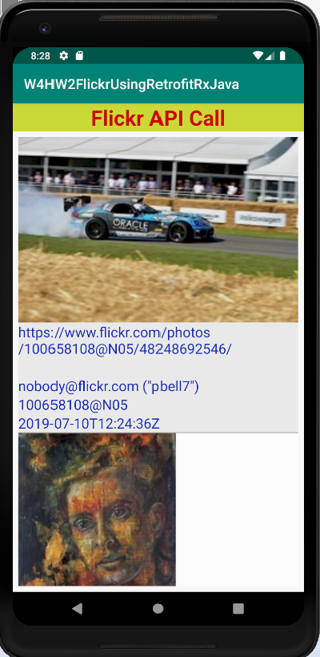

# W4D2HWFlickrRetrofitRxJava
Week 4 Daily 2 Homework Research and Flickr Retrofit/RxJava

Homework Research file is located in root: Week4Daily2HomeworkResearch.docx.

Coding
Create an application to use the Flickr api.

1. You can use the following endpoint to get the images http://api.flickr.com/services/feeds/photos_public.gne?tag=kitten&format=json&nojsoncallback=1

2. Screen 1: Should show a recycler view with all the images from the api. Each ItemView should have a thumbnail of the image and two more fields.

3. On Clicking long press on each item a dialog box with two options will appear. “Show full image” and “Show small image”. You can add options to the array in an xml and pass to the dialog. https://developer.android.com/guide/topics/ui/dialogs.html#AddingAList

4. “Show full image” will start a new activity and cover the whole screen with the passed picture.

5. “Show small image” will show the image in a dialog in the same activity.
MUST USE RETROFIT/RxJava

Instructions:

Run the Android project
- Create a new Virtual Device if not already. Then, choose Pixel 2 XL, then click OK.
- The application makes an API call from Flickr and display it as a list onto a recycle view.
- Click on the images to see the option to view it bigger or smaller.

